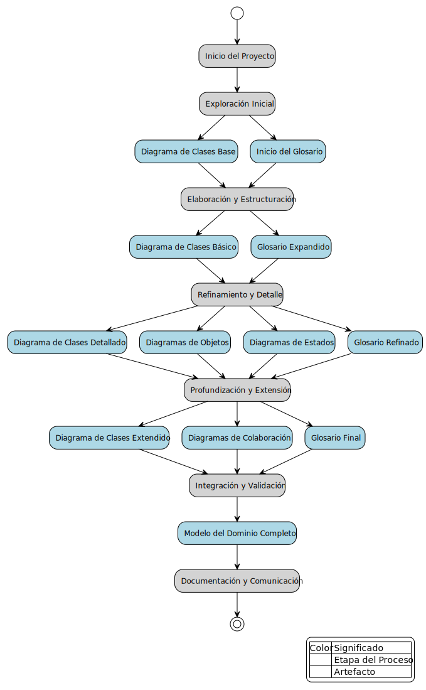

# Enfoque de Construcción del Modelo del Dominio

## ¿Por qué?

El modelado del dominio es necesario debido a varios desafíos que enfrentan los equipos de desarrollo:

1. **Confusión conceptual**: A menudo existe una falta de claridad sobre los conceptos clave del dominio y sus relaciones.
2. **Barreras de comunicación**: Hay dificultades para establecer un lenguaje común entre desarrolladores, expertos del dominio y stakeholders.
3. **Complejidad del dominio**: Muchos dominios de negocio son inherentemente complejos y difíciles de comprender en su totalidad.
4. **Evolución del conocimiento**: El entendimiento del dominio cambia y evoluciona a lo largo del tiempo, lo que puede llevar a inconsistencias.
5. **Desconexión entre requisitos y implementación**: Existe el riesgo de que el software desarrollado no refleje adecuadamente las necesidades reales del negocio.

## ¿Qué?

Para abordar estos desafíos, nuestro enfoque de modelado del dominio busca aclarar:

1. **Estructura del dominio**: ¿Cuáles son las entidades principales y cómo se relacionan entre sí?
2. **Comportamiento del sistema**: ¿Cómo interactúan estas entidades y qué procesos siguen?
3. **Estados y transiciones**: ¿Cómo cambian las entidades a lo largo del tiempo y en respuesta a qué eventos?
4. **Reglas de negocio**: ¿Qué restricciones y lógica de negocio gobiernan el dominio?
5. **Lenguaje ubícuo**: ¿Cuáles son los términos y conceptos clave que todos los involucrados deben entender y usar consistentemente?
6. **Escenarios clave**: ¿Cómo se comporta el sistema en situaciones específicas y representativas del dominio?
7. **Límites del sistema**: ¿Dónde comienza y termina nuestro dominio, y cómo interactúa con sistemas externos?

## ¿Para qué?

Nuestro enfoque de modelado del dominio aborda estos aspectos de la siguiente manera:

1. **Comprensión profunda**: Permite a los equipos de desarrollo comprender en profundidad el dominio del problema, mitigando la confusión conceptual.
2. **Comunicación efectiva**: Establece un lenguaje común y preciso entre todos los involucrados, superando las barreras de comunicación.
3. **Manejo de la complejidad**: Descompone el dominio en partes manejables y visualizables, facilitando el entendimiento de sistemas complejos.
4. **Adaptabilidad**: Proporciona una base flexible que puede evolucionar junto con el conocimiento del dominio, manteniendo la consistencia.
5. **Alineación con el negocio**: Asegura que el software desarrollado refleje fielmente las necesidades y procesos del negocio.
6. **Validación continua**: Permite verificar constantemente que el modelo refleja con precisión el dominio real.
7. **Base para el diseño**: Sirve como fundamento sólido para las decisiones de diseño y arquitectura del sistema.
8. **Documentación viva**: Actúa como una referencia actualizada y coherente del conocimiento del dominio.

## ¿Cómo?

El proceso de construcción del modelo del dominio siguiendo este enfoque se estructura en las siguientes etapas:

<table>
    <tr>
        <td valign=top width=50%>

1. **Exploración inicial**:
   - Realizar entrevistas con expertos del dominio.
   - Analizar documentación existente sobre el dominio.
   - Crear un diagrama de clases base muy simple, capturando las entidades más obvias.
   - Iniciar el glosario del dominio con los términos clave identificados.

2. **Elaboración y estructuración**:
   - Evolucionar el diagrama de clases base a una versión básica, ajustando entidades y añadiendo relaciones clave.
   - Comenzar a identificar algunos atributos importantes en las entidades principales.
   - Expandir el glosario con definiciones más detalladas.
   - Validar esta versión con los expertos del dominio.

3. **Refinamiento y detalle**:
   - Desarrollar un diagrama de clases más detallado, incluyendo atributos completos y refinando las relaciones.
   - Crear diagramas de objetos para representar escenarios específicos del dominio.
   - Elaborar diagramas de estados para las entidades más significativas.
   - Continuar la expansión y refinamiento del glosario.

4. **Profundización y extensión**:
   - Evolucionar hacia un diagrama de clases extendido, incluyendo detalles cercanos a la implementación.
   - Desarrollar diagramas de colaboración entre clases para ilustrar las interacciones clave.
   - Refinar todos los artefactos basándose en el feedback continuo de los expertos.

5. **Integración y validación**:
   - Asegurar la consistencia entre todos los artefactos desarrollados.
   - Realizar una revisión integral del modelo con todos los stakeholders.
   - Ajustar el modelo según sea necesario basándose en el feedback final.

6. **Documentación y comunicación**:
   - Compilar todos los artefactos en un documento coherente del modelo del dominio.
   - Presentar el modelo completo al equipo de desarrollo y stakeholders clave.
   - Establecer el modelo como la referencia base para las siguientes fases del desarrollo.

        </td>
        <td valign=top width=50%>
        
        
        
        </td>
    </tr>
</table>

